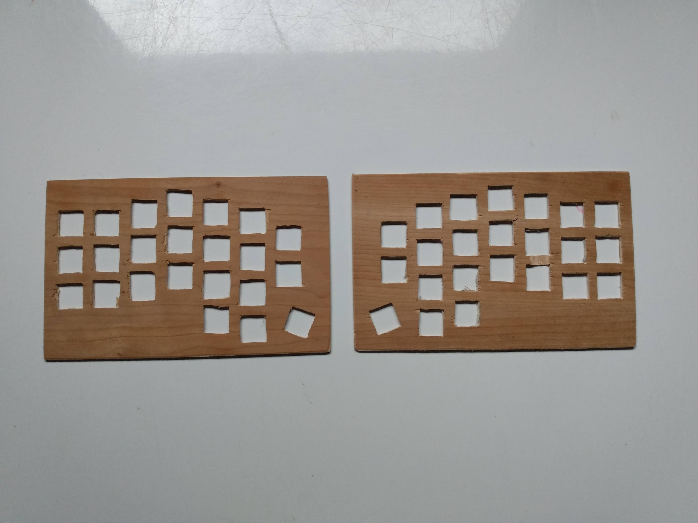
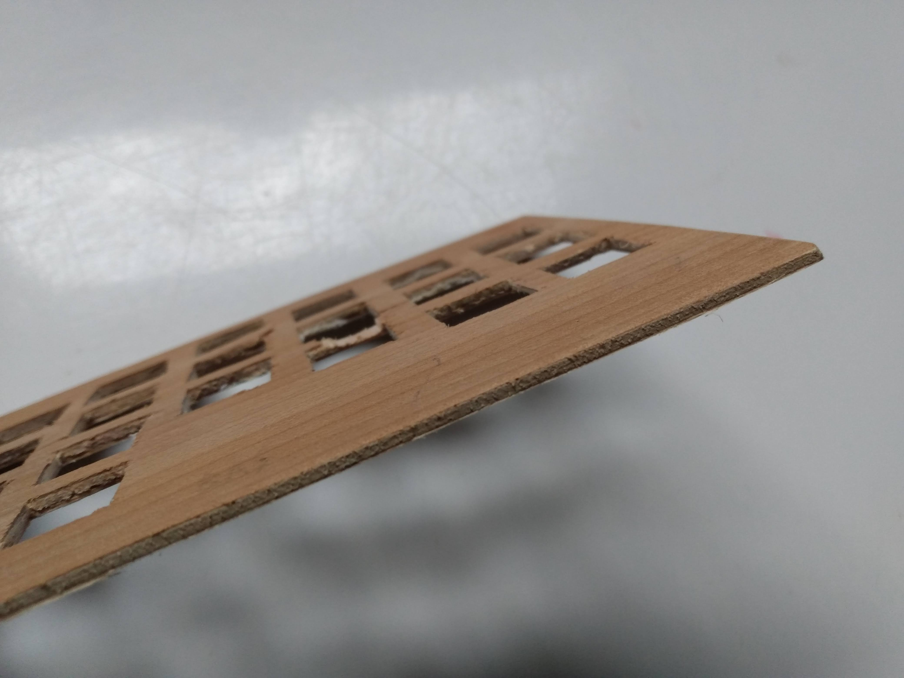
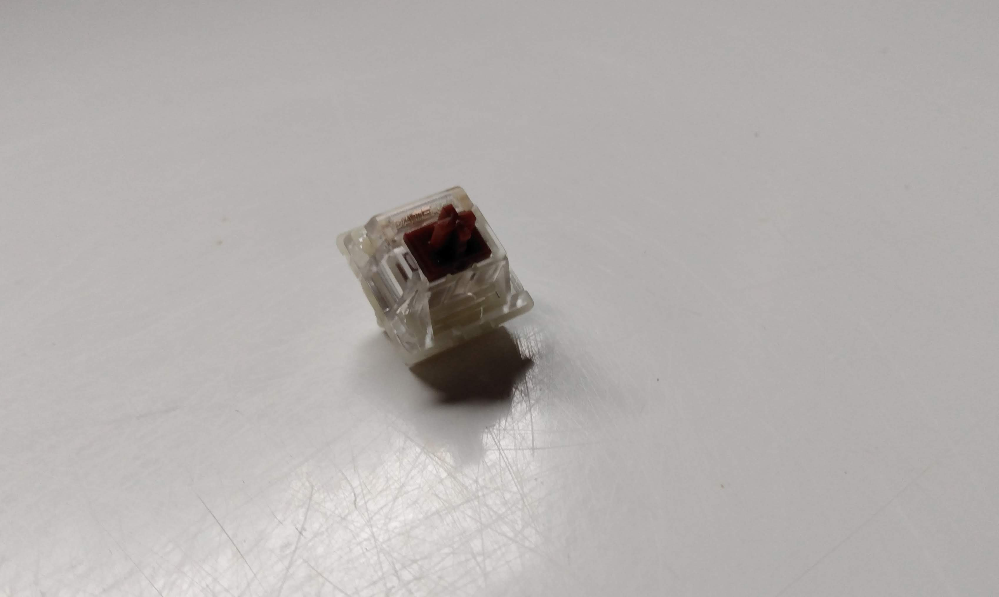
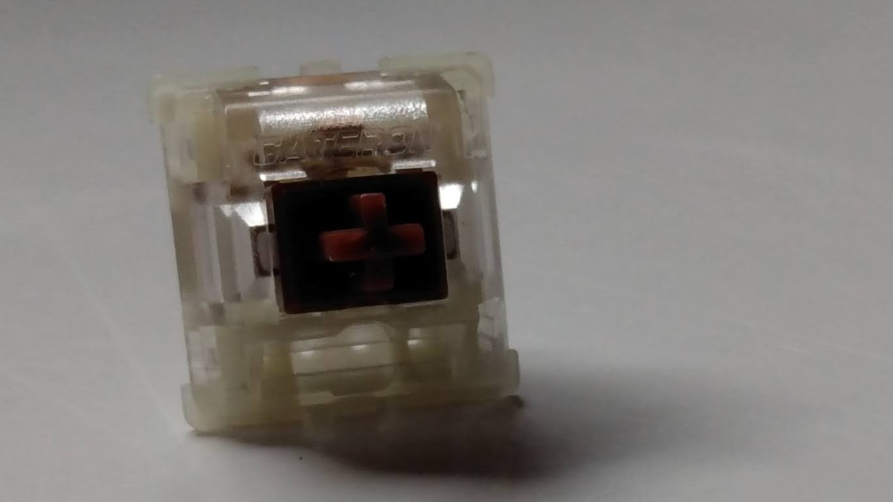
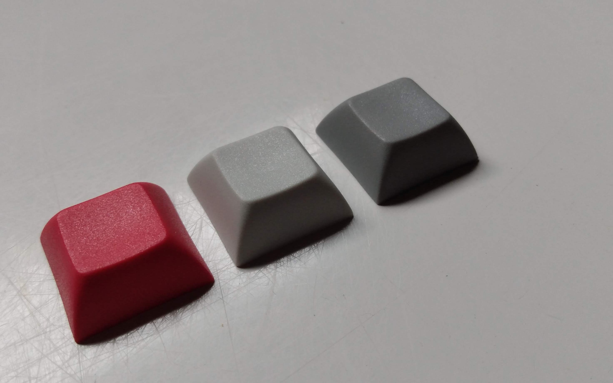

# _Astro46_

## Case Making

I used a piece of wood that was laying around.
I started by cutting it into rectangles of
approximately the good size. I then drilled
and filled holes to accomodate the switches
according to my layout. I made a layout using
[KLE](http://www.keyboard-layout-editor.com/).
I then made and printed a case layout with
this [builder](http://builder.swillkb.com/).

This is the following result.

## Switches and Keycaps

Already owning a cheap mechanical keyboard
with brown switches, I decided to stay with
brown switches. I got Gateron Silents Browns of AliExpress.

Then for the keycaps, I wanted something
really cheap as I was thight on budget and
so I went with some blank DSA also from AliExpress.

## Soldering

## Firmware Setup

## Layout (French)

