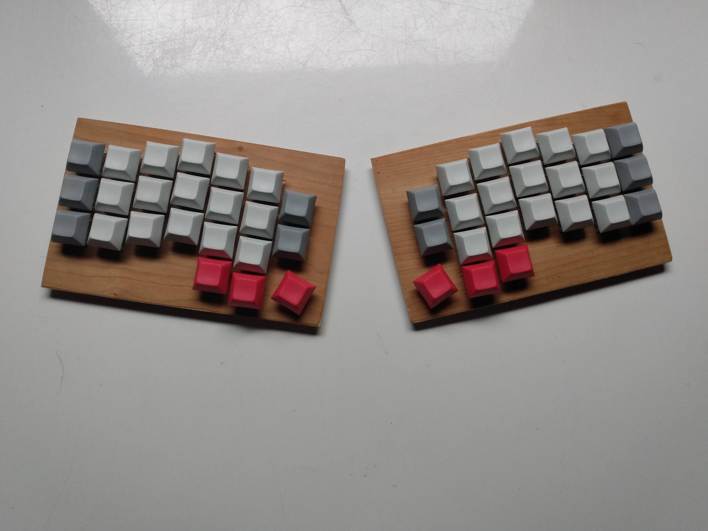

# _Astro46_

## Case Making

I used a piece of wood that was laying around.
I started by cutting it into rectangles of
approximately the good size. I then drilled
and filled holes to accomodate the switches
according to my layout. I made a layout using
[KLE](http://www.keyboard-layout-editor.com/).
I then made and printed a case layout with
this [builder](http://builder.swillkb.com/).

This is the following result.

## Switches and Keycaps

Already owning a cheap mechanical keyboard
with brown switches, I decided to stay with
brown switches. I got Gateron Silents Browns of AliExpress.

Then for the keycaps, I wanted something
really cheap as I was thight on budget and
so I went with some blank DSA also from AliExpress.

## Preparation Before Soldering

From now on, I mostly follow
[this](https://www.youtube.com/watch?v=zY2k75eWrLQ)
tutorial. So, I before taking out my soldering
iron I glued the switches in place as I had
some holes that were looser. I then put the
keycaps on the switches to provide a smoother
and more leveled surface for my plank to
be turned upside down on. I finishes the
preparation by bending my diodes in a similar manner as the tutorial proposes.

Here's what it looks like.

## Soldering

I then moved on to soldering. The first things
to solder are the diodes that were bent.
The diodes form the rows of the switches
matrix. And so after soldering all the diodes this is what it looks like.

After the diodes were soldered, I put some
hot glue on top of it to isolate them. I
then proceeded to solder some simple wires to the columns of the matrix.

To finish the wiring of the switch matrix, I had to solder the rows from the two halves together. I did so by running one long wire per row into a shoe lace.

The final soldering part is to solder the
rows and columns to the micro controller.

I will put the micro controller in the left hand, so I have to send the rows of the right hand to the left hand first. I did so the same way as the last step, through a lace.

## Firmware Setup

## Layout (French)

